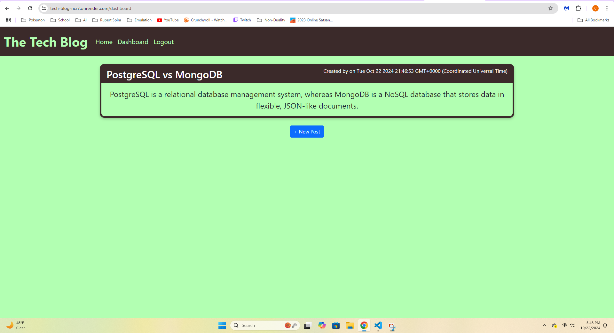
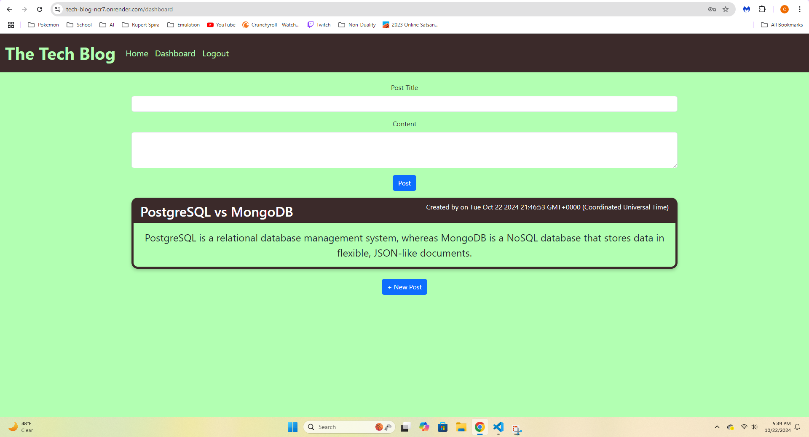

# Tech Blog

## Description
This is a tech blog for developers to share posts on the current tech. It's for sharing thoughts, opinions, news or whatever else the developer wants to post about. It uses PostgreSQL relational database to keep track of everything.

## Usage
When first on the site, you can view all posts by other users, but in order to create a post you need an account. So click the login button at the top and either login or signup. Then on the dashboard, you can create a new post, edit a post you've made, or delete a post you've made. The dashboard will show only your posts.

## Technologies
- Node.js
- Express
- PostgreSQL
- Handlebars
- Bootstrap
- jQuery

## Screenshots

## Links
- https://tech-blog-ncr7.onrender.com/
- https://github.com/ckisi/tech-blog

## Credits
Xpert Learning Assistant
